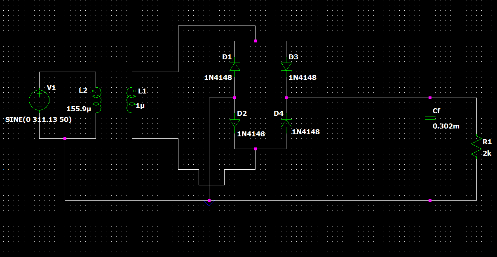

# Introduction

This document is a report for the design of a regulated DC power supply that can deliver 2 mA current at 20 Vo. It is created to be easy to build and customize for your particular project needs. Along with objective of giving a basic knowledge of how a DC regulated power supplies work. 

DC power supply is an essential part of any power 
supply unit used by all electronics devices to convert AC signal into a steady DC signal.This is done with the use of many intertwined components. Obvious examples that can 
be listed are mobile and laptop chargers, TV, . . . etc. The practical devices are mainly manufactured on a PBC inside large factories but 
in in this project, as per the instruction of my instructor a simulated version of the actual 
circuit will be constructed using LTSpice software. 
The working principle of DC supply designed here is first to convert the AC signal 
input to a lower peak voltage to be used by the diode bridge rectifier with step down 
transformer. Then the diode bridge rectifier is used to convert both halves of each wave 
form cycle into pulsating DC signal using four rectification diodes. This signal obviously 
will not generate a stable DC supply and contains large ripple voltages because the 
diode mainly flips the negative part of our signal. It will not regulate it or filter it in any 
way.  

After this to decrease of voltage difference of the ripple signals, we will use a filter 
(a smoothing capacitor) across the bridge rectifier, which with a high level of 
capacitance ripple voltages can be decreased significantly. 
The last part of our design will be a Zener regulator (which is a special type of 
diode that also works in a reverse biased conditions). When the Zener diode is reverse 
biased current through increased dramatically to maximum value, which remains 
constant over a wide range of reverse voltages. 
This is just a recap of the full description. In
 the rest of the document a detailed 
description of component and their type will be discussed. Any mistakes observed on 
this document will be the responsibility of the compiler, and we hope more explanation 
and correction will be provided on my mistakes in the future.

 

# Objective
The main objective of this project is to design a regulated DC power supply that can deliver IC = 2mA at Vcc = 20V to bias an NPN BJT amplifier when a resister load RL is connected (Assuming RL is constant). As shown in the figure below. 

 

 

 

To get the necessary components in our project use considered the outputs 
indicated in the project’s description, then we worked our way up with calculations. we 
first started with the regulator then the filter, lastly the transformer. All the parts were 
designed in such a way that our output requirements were met.

Here is a table of the components that were used for the completion of this project. 

| Component Type | Name    | Numbers | Value(respectively) |
| -------------- | ----    | ------- | ------------------- |
| Capacitor | Cf| 1       | 0.302 mF | 
| Inductor | L1, L2        | 2       | 155.9 $\mu$F | 
| Resistor | Rc | 1       | 733 $\Omega$ | 
| Diode | 1N4148           | 4       | Vforward = 0.75 V | 
| Zener Diode | BZX384B20  | 1       | Vreverse = 20 V | 
| Voltage Source | Vinput | 1 | Vrms = 220 V | 
||

 

# The Transformer

Video 1: Transformer animation(Tap the Video)</i></b> 

Transformers are electrical devices that consist of two or more coils of wire used to transfer of convert voltage of electrical energy using alternating magnetic fields without change of electric field. A transformer can be either a step down or a step up. Which basically depend on the number of turns in the primary and secondary windings. Mathematically the relation is given as:

$\frac{Ninput}{Noutput}$  =  $\frac{Vinput}{Voutput}$

Like all the components used in this project. The design and development of the transformer will be done on <b><i>LTSpice</i></b>. We know from our given instructions the input voltage will have a potential of 220V and frequency of 50Hz. So, we need to convert this signal into a one which is suitable for our rectifier using the appropriate numbers.
As per our calculations that were discussed earlier, we would want an output voltage of approximately 20V for our rectifier. We can see from the equation above to get the desired value we must make our ratios of Primary Inductance to Secondary Inductance 155.9:1.

 Figure 2: Plot of Input(Green) and Output(Blue) signals of Transformer in <b><i>LTSpice</i></b> 

 

Generally, when using a real transformer the flux generated by the primary windings link to every winding, taking paths that make it outside the windings. This flux is known as leakage flux, creating leakage inductance. This doesn’t necessarily create power loss, but results in an inferior voltage regulation. For this reason, this feature should be considered in a real-life design of a DC regulated power supply. Since this project uses an ideal simulation of a transformer no such consequences will be considered in design. Furthermore, we would like to note that the primary inductor has an internal resistance of 0.00001Ω. Hence can’t be considered as ideal.

 

# The Rectifier

Video 2: Rectifier Circuit Animation (Tap the Video)

A Rectifier is an electrical device that converts alternating current (AC), which periodically reverses direction, to direct current (DC), which flows in only one direction. The process is known as rectification. 
Physically, rectifiers take several forms, including vacuum tube diodes, mercury-arc valves, copper and selenium oxide rectifiers, semiconductor diodes, silicon-controlled rectifiers, and other silicon-based semiconductor switches. Historically, even synchronous electromechanical switches and motors have been used. Early radio receivers, called crystal radios, used a "cat's whisker" of fine wire pressing on a crystal of galena (lead sulfide) to serve as a point-contact rectifier or "crystal detector". But the purpose of this projected as specified by our instructor we will use full wave bridge rectifier.The full wave rectifier converts both halves of each waveform cycle into pulsating DC signal using four rectification diodes. This is done with the help of four diodes with only two diodes conducting current in each half cycle.
 

Vout = Vin - Vdiode - Vdiode
 
Vout = 25 - 0.75 - 0.75
 
Vout = 23.5V

After getting the necessary input from the step-done transformer it is rectified by our rectifier and its respective values can be observed from pictures of the wave. As it can be observed from the circuit, we used four 1N4148 diodes for the rectification process with an average of forward voltage drop of 0.75V.
One assumption we will make about our diodes is that although they may exhibit some form of resistivity, we will ignore those resistances because they are comparatively insignificant to our circuit analysis and made no observable difference when considered on our calculations.

Figure 3: Output Plot of Rectifier output in <b><i>LTSpice</i></b> 

 

# The Smoothing Filter

 
 

Video 4: Filter Circuit Animation 

Filter circuits are combinations of R, L or C elements which improve the rectification, and efficiency of a rectifier circuit by reducing the ripple factor. Since for the case of our circuit the rectified voltage is used as an input for further filtering. The theory of operation of a capacitor is simple. The basic principle is that to fill a dielectric material between two conducting surfaces to store more energy. In DC circuit the voltage source is generally used as a charge to fill the capacitor with charges. 
But in the case of AC circuits the main use of capacitor will start to show up. This is because when the circuit is going through the first phase of charging the capacitor is also charged to the peak voltage, then until the circuit goes through the other half of the cycle since the capacitor wouldn’t allow the drastic drop of voltage a constant potential difference across the connected load it will provide a steady voltage drop. The capacitor offers very low resistance to high frequency signals, for this reason high frequency signals go through the capacitor and low frequency signals like DC signals will go through the resistor. The basic assumptions we took for this case is that to make sure the lifetime of the capacitor is much greater than the period of our signal. So, our capacitor can give its full capacity with enough time.

 Figure 5: Rectifier and Filter Circuit Simulation in <b><i>LTSpice</i></b> 

In the construction of our filter it is very important to consider the ripple voltage. Ripple voltage is the fluctuation that is observed in the output side of our filter circuit. We mainly concern ourselves with this factor to make sure our regulator is turned on after filteration. If for instance the riple voltage is too great and at some points doesn’t turn on our zener diode we might not be able to have effectively working regualtor.The formula for the ripple factor is drived from the formula of voltage of the capacitor.

 Vc = Vcmax * e-t/RC

As discuseed earlier this assumption to take that will make our calculations much simpler is the time it takes the capator to charge is half of  the period of the signal and the time constant is much much larger than the period of the signal.

 

 i.e t = T/2 and RC >> T/2 

 

Using the above assumptions we can expand Vc using Taylor Series as follows:

 Vmin = Vmax*(1 - T/2RC)

 Vripple = Vmax - Vmin

 Vripple = Vmax - Vmax + Vmax*T/2RC

 Vripple = Vmax*(T/2RC)

 
To be on the safe side of our calculations let’s make the ripple voltage approximately 1V which is less than the requirement given 2V. Inserting those values on the above equation we see that.    

<b> RC = 0.235sec </b>

NOTE:  the values of R and C  will not be calculated here for reason to be discussed in the next section of the regulator.

Figure 6: Graphed Rectifier and Filter Circuit Simulation in <b><i>LTSpice</i></b> 

 

# The Regulator

 Voltage regulator are one of the most important and commonly used electrical component in electrical engineering. Voltage regulators are responsible for maintaining a steady voltage across an electronic system. 
 Voltage fluctuations may result in undesirable effect on an electronic system, so to maintaining a steady constant voltage is necessary according to the voltage requirement of a system. 
         
The working principle of the Zener diode is same as ordinary diode in forward biased conditions but when it counters reverse biased conditions and the reverse voltage reaches the predetermined Zener break down value the diode begins to conduct 
electricity in the reverse region. 
This is very useful to maintain low ripple output with a varying load current. The next part of our discussion will be then the calculation of the value that make up the shunt resistance of the regulator. and also, value of the 
capacitor. 

We know that form our given preconditions that current through the load was 2mA and the voltage across the load is 20V so we can conclude that the load resistance has a value of 10kΩ by ohms law. 
If Vzener = 20 V then Vin that is set to the Zener diode must be configured in such a way that it’s value to be greater than Zener’s voltage so to find the voltage across the 
Zener diode we will find Thevenin voltage equivalent across the Zener diode’s terminal for a given input and check if our result from the capacitor meets our requirements. Then by voltage division assuming ƨﾨm to be input voltage on the regulator we know that the Thevenin equivalent will be.

VTh =  $\frac{Rl*Vin}{ Rl + Rs}$

If VTh > 20 V . . . . . .  must be satisfied to turn on the zener diode in the reverse biased condition. So, after doing some calculation Rs will turn out to be

 

Rs <  $\frac{Rl*(Vin - 20)}{20}$

Rs <~ 1.75k ohm 

 
Another assumption to consider when working with the resistor will be the current though the Zener diode which according to instruction is set to half of the maximum current that the Zener diode could carry. (i.e. 2.5mA). In addition we know Vin is output of the filter which approximately equals to 23.5V putting this into our equation we get 

VR = IR*R

 

 IR = IZ + IL

 

 VR = Vin - VZ

 

R =  $\frac{23.5V - 20V}{2mA + 2.5mA}$

R=777.8Ω . . . . . . which satisfies initial constraint of the resistor.
In addition to this we have the value of RC from our calculation in the smoothing filter. Entering the value of R, we will get a capacitance of.

 C=0.302mF

Now we can clearly see why we avoided the calculation of R and C in the filter, it was because  we needed the constraints of the instruction to get the value of R and C that will meet our requirements.
